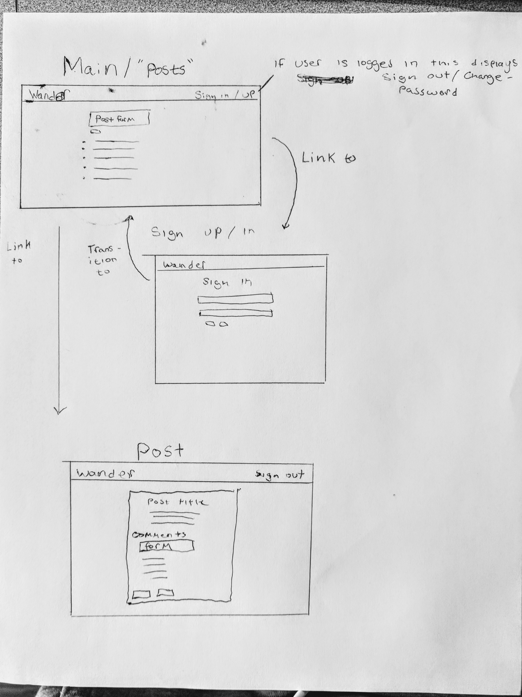

# Welcome to Wander

Wander is a ~~social network~~ blogging platform that intends to give travellers a place to share their travels, suggestions and experiences with a community of fellow explorers. Blog posts may be commented on and all CRUD actions are possible. For this iteration, comments may only be created.  As of right now, these are the only features [but there will be many more to come](#future-releases)
[Link to Client deployed via GH pages](https://mattgoldman93.github.io/wander-app-client/#/posts)
[Link to API repo](https://github.com/Mattgoldman93/wander-app-api)
[Link to API deployed via Heroku](https://dreadful-citadel-51922.herokuapp.com/)

## Development Process
  I approached this project differently than I had approached my others throughout this course. I knew what I wanted the end result to be and I realized that it was an ambitious undertaking. I also planned on using the ember framework, with which I was not entirely familiar, for my client side. This added an additional level of difficulty. Before starting the project, I researched several ruby gems to be used in my API and several ember add-ons to be used on the client side. I believed that by using these add-ons I could avoid "reinventing the wheel" and would be able to reach my goals faster. Unfortunately, this was not the case. Fitting these gems and add-ons to my specific use cases was much more challenging than I imagined and this fact was only exacerbated by my failure to carefully plan out this project and how I would achieve the end product I wanted to. Instead of creating a minimum viable product to meet requirements, I attemptepted to dive right in and figure out what worked and what didn't as I went along. **This was a huge mistake**. Additionally, I failed to follow the tried and true suggested schedule provided by GA and affirmed through many past projects. Eventually, I decided to abandon the use of any add-ons or gems and the result was an end product that fell far short of my intended goal of creating something of a social network. Nevertheless, there will be future iterations and given more time I hope to be able to figure out and implement add-ons and gems that will create a richer user experience.

  As for my client side, the ember add-ons I tried to used were mainly for the goal of allowing users to upload and display photos (what's a travel site with no photos?). The add on I tried to use was [Ember Uploader](https://github.com/benefitcloud/ember-uploader). The entirety of day 3 was spent in an attempt to integrate this with my app. At this point I had built a very simple client side to test my back-end. It allowed for users to create posts and as I can remember that was all. On the bright side, after failing to successfully implement this addon I realized that if I wanted to have something to show by presentation day, I would need to abandon the idea of using add-ons to take shortcuts and build an MVP within the next three days.
  The next three days were spent doing just that. I ensured that my client supported all CRUD actions for post and that user-ownership worked. I then had to decide whether to implement a "favorite posts" feature or allow comments. I decided that comments would be more important as they would add more user interactivity than favorites would. I had generated files in my API for favorites but as of right now, they remain unused.
  My biggest challenge with this was getting comments to be stored in the database with the comment's content, post reference, and user reference. It seemed I could only get 2/3 at one time. The problem ended up being with my serializer on the back-end. [A more detailed description can be found in the back-end readme](https://github.com/Mattgoldman93/wander-app-api). Another hurdle was getting the user owner of posts and comments to appear on the client side. After many different approaches and quite a bit of frustration, this was solved by editing the client-side models to include 'user' in addition to 'user_id'. I then was able to pull model.user.email into the templates for post and comments.
  ## Technologies used
  Technologies used included Ember CLI, HTMLBars templating, Javascript, SASS and Ember bootsrap.

  ## Future Releases
  There are many more features I would like to implement in future release. A few of these have been implied in my description of the development process, namely the ability to 'favorite' posts and add photos to posts. Additionally, I would like to allow users to follow other users and see 3 feeds: all posts, followed posts, and owned posts. I want the update and delete buttons to only appear if the post is owned by the current user. I would also like to make posts more structured, e.g having fields for things such as suggested places to eat and stay, tips, places to stay away from etc. I would also like users to pin places on google maps and embed maps within a post. Another feature that I may implement much further down the road is a Map View, where users can find posts by selecting pins on a map. Probably the first addition I'd like to make, though, is allowing all CRUD actions on comments.
  ## Wireframe & User Stories
   - As a user I want to be able to write a post about travels
   - As a user I want to be able to comment on other's posts
   - As a user I want to read comments on my own posts
   - As a user I want to have the option to update a post I've made
   - As a user I want to be able to delete a post I've made
   
